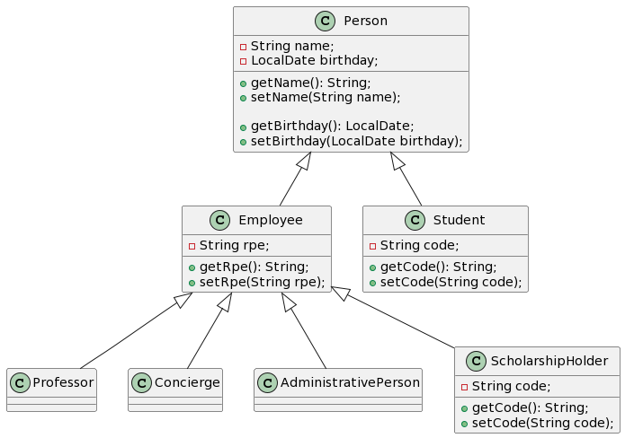

@startuml

class Person{
- String name;
- LocalDate birthday;

+ getName(): String;
+ setName(String name);

+ getBirthday(): LocalDate;
+ setBirthday(LocalDate birthday);
  }

class Employee extends Person {
- String rpe;

+ getRpe(): String;
+ setRpe(String rpe);
  }

class Student extends Person {

- String code;

+ getCode(): String;
+ setCode(String code);

}

class Professor extends Employee  {

}

class Concierge extends Employee{

}

class AdministrativePerson  extends Employee{
}

class ScholarshipHolder  extends Employee {
- String code;

+ getCode(): String;
+ setCode(String code);
  }

@enduml

-------------------------------------------------------------------------------------------------------------

-------------------------------------------------------------------------------------------------------------
¿Qué es Herencia múltiple y porque java no la soporta?

Herencia múltiple, es cuando una clase tiene mas de un padre.
Java no lo soporta porque una clase solo puede tener un padre.
    - evitar la ambiguedad de código 
    - dar mas simplicidad a Java, con respecto a otros lenguajes
    - causa más problemas de los que resuelve
    
Un programador podria involuntariamente introducir un conflicto de nombres añadiendo un nuevo método
a una superclases.

Probelma del Diamante:
        Si una clase hija de dos padres, que tienen un mismo método (con el mismo nombre), cuando esta clase
        deba llamar a ese método, ¿a cuál método estaría llamando?

Este es el principal motivo por el que la herencia múltiple no es posible en java. 